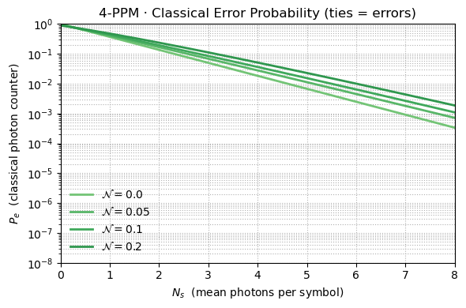
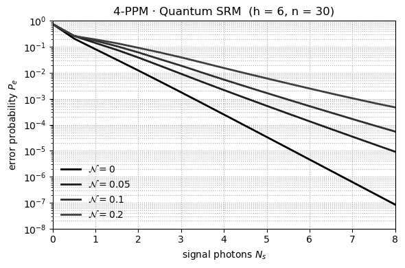
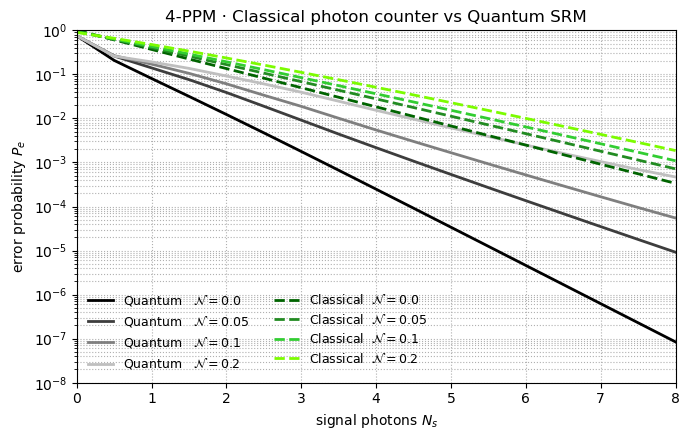

# PPM-4 Error Probability — Classical Photon Counting vs Quantum SRM

This project studies symbol-error probability \(P_e\) for **4-slot pulse-position modulation (PPM-4)** under two receivers:

- **Classical photon counting** (choose the slot with the largest photon count)
- **Quantum square-root measurement (SRM)** (the optimal symmetric POVM for these states)

The implementation and plots are in **Final_Code.ipynb**, and the derivations/background are in **Report.pdf**.

---

## What we did (method in brief)

- **Channel & symbols.** One “on” slot (signal) and three “off” slots per 4-PPM symbol; background light modeled as displaced-thermal noise with mean photons/slot \(N\). Signal energy \(N_s\) is the mean photons in the on slot.
- **Classical receiver.** Counts in each slot are modeled as independent Poisson RVs: on-slot \(\mathrm{Pois}(N_s+N)\), off-slots \(\mathrm{Pois}(N)\). The correct decision occurs when the on-slot count exceeds all three off-slot counts. We compute the exact \(P_e\) from these order statistics.
- **Quantum SRM receiver.** We construct the 4 symmetric signal states and apply the **square-root measurement** (SRM), which maximizes average correct detection for symmetric ensembles. Practically, we build the Gram matrix of state overlaps and evaluate \(P_e = 1-P_c\) from the SRM POVM elements.
- **Sweep.** We sweep \(N_s\) over a practical range (photons) at several background levels \(N\) and plot \(P_e\) vs \(N_s\) (log scale).

---

## Results (figures)

### 1) Classical photon-counting receiver
<figure>
  
  <figcaption>
    <strong>Figure 1.</strong> Error probability \(P_e\) for the classical receiver vs signal energy \(N_s\), with multiple curves for different background levels \(N\). 
    As expected, higher \(N_s\) lowers \(P_e\); more background \(N\) shifts the curves upward. At very low \(N_s\), the error approaches the random-guessing limit (3/4 for 4-PPM).
  </figcaption>
</figure>

### 2) Quantum SRM receiver
<figure>
  
  <figcaption>
    <strong>Figure 2.</strong> \(P_e\) for the quantum SRM. The SRM uniformly outperforms photon counting: for the same \(N\) and \(N_s\), the SRM curve sits markedly lower, indicating higher detection reliability especially in the low-photon regime.
  </figcaption>
</figure>

### 3) Side-by-side comparison
<figure>
  
  <figcaption>
    <strong>Figure 3.</strong> Overlay of classical vs SRM curves. The **gap** between the black/gray (SRM) and green (classical) curves quantifies the quantum advantage. Across the sweep, SRM achieves **orders-of-magnitude** lower error probability—often \(10^2\!-\!10^3\)× better—most prominently at moderate \(N_s\) and non-zero background.
  </figcaption>
</figure>

---

## Key takeaways

- **SRM dominates** photon counting for 4-PPM across practical signal and background levels.
- The **advantage is largest** where classical counting struggles: low-to-moderate \(N_s\) and non-negligible background \(N\).
- As \(N_s\) grows large, both receivers approach very low error, but **SRM reaches that regime sooner** (lower \(N_s\) for the same \(P_e\)).

---

**Files in this repo**
- `Final_Code.ipynb` — end-to-end notebook to compute curves and generate figures.
- `Report.pdf` — project report with derivations and references.
- `plot_classical.png`, `Plot_SRM.png`, `plot_output.png` — the figures described above.
